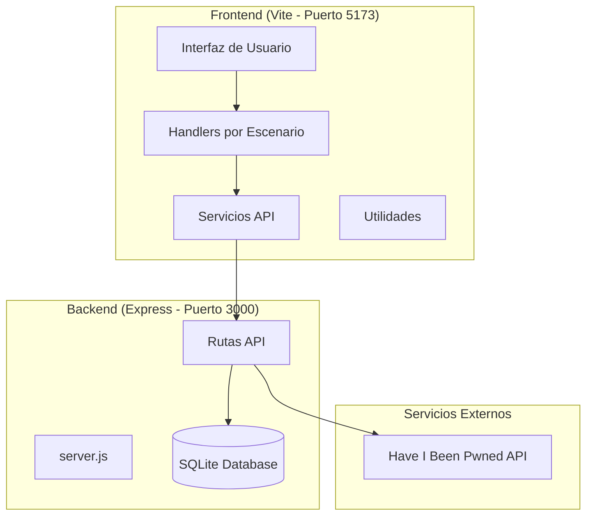
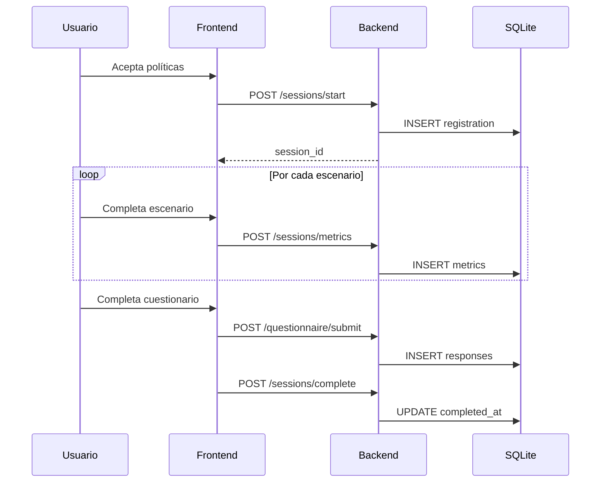

# TechNova LYNX Platform - Documentación Técnica Completa

## 📋 Resumen Ejecutivo

**TechNova** es una plataforma de simulación para la evaluación de seguridad de usuarios en la plataforma **LYNX**. La aplicación está diseñada como un estudio que guía a los participantes a través de múltiples escenarios de seguridad (phishing, gestión de contraseñas, MFA, cookies, etc.) y registra métricas de comportamiento para análisis posterior.

---

## 🏗️ Arquitectura General

El proyecto sigue una **arquitectura separada Frontend/Backend**:

```
TechNova/
├── backend/              # Servidor Node.js/Express con SQLite
├── frontend/             # Aplicación Vite (JS Vanilla)
├── package.json          # Scripts raíz para desarrollo
├── .env                  # Variables de entorno
└── main.html             # [Legacy] Archivo principal alternativo
```

### Diagrama de Arquitectura



---

## 🔧 Backend - Servidor Express

### Archivo Principal: `backend/server.js`

El servidor Express configura:

- **CORS** habilitado para peticiones cross-origin
- **JSON parsing** para body de requests
- **Puerto**: Configurable via `.env`, por defecto `3000`
- **Base de datos**: SQLite local (`lynx-study.db`)

```javascript
import express from 'express';
import cors from 'cors';
import { setupSessionRoutes } from './routes/sessions.js';
import { setupBreachRoutes } from './routes/breach.js';
import { setupQuestionnaireRoutes } from './routes/questionnaire.js';

const app = express();
app.use(cors());
app.use(express.json());

app.use('/api/sessions', setupSessionRoutes());
app.use('/api/breach', setupBreachRoutes());
app.use('/api/questionnaire', setupQuestionnaireRoutes());
```

---

### Base de Datos: `backend/database.js`

Utiliza **better-sqlite3** con modo WAL para mejor rendimiento. Define 4 tablas principales:

| Tabla                     | Propósito                             |
| ------------------------- | ------------------------------------- |
| `registrations`           | Sesiones de usuarios/participantes    |
| `breach_checks`           | Resultados de verificación de brechas |
| `questionnaire_responses` | Respuestas del cuestionario final     |
| `session_metrics`         | Métricas detalladas por escenario     |

#### Esquema de `registrations`

```sql
CREATE TABLE registrations (
    id INTEGER PRIMARY KEY AUTOINCREMENT,
    username TEXT NOT NULL,
    service TEXT NOT NULL,
    password_strength TEXT,
    mfa_enabled INTEGER DEFAULT 0,
    participant_id TEXT NOT NULL UNIQUE,
    password_reuse_count INTEGER DEFAULT 0,
    created_at TEXT DEFAULT (datetime('now')),
    completed_at TEXT
);
```

#### Esquema de `session_metrics`

```sql
CREATE TABLE session_metrics (
    id INTEGER PRIMARY KEY AUTOINCREMENT,
    session_id INTEGER NOT NULL,
    scenario TEXT,
    metric_name TEXT NOT NULL,
    metric_value TEXT,
    recorded_at TEXT DEFAULT (datetime('now')),
    FOREIGN KEY(session_id) REFERENCES registrations(id)
);
```

---

### Rutas API

#### 1. Sessions (`/api/sessions`)

| Método | Endpoint              | Descripción                            |
| ------ | --------------------- | -------------------------------------- |
| `POST` | `/start`              | Inicia o recupera una sesión existente |
| `POST` | `/complete`           | Marca una sesión como completada       |
| `POST` | `/metrics`            | Guarda métricas de un escenario        |
| `GET`  | `/all`                | Obtiene todas las sesiones (Admin)     |
| `GET`  | `/:sessionId/metrics` | Obtiene métricas de una sesión         |

**Ejemplo de `/start`:**

```javascript
// Request
{
  "userIdentifier": "P001",
  "service": "mail",
  "participantId": "P001",
  "passwordStrength": "strong"
}

// Response
{
  "success": true,
  "session": { "id": 1, "username": "P001", ... },
  "created": true
}
```

#### 2. Breach Checker (`/api/breach`)

| Método | Endpoint   | Descripción                             |
| ------ | ---------- | --------------------------------------- |
| `POST` | `/check`   | Verifica email contra Have I Been Pwned |
| `GET`  | `/history` | Historial de verificaciones             |

> [!NOTE]
> Si no hay `HIBP_API_KEY` configurada, devuelve datos simulados para desarrollo.

#### 3. Questionnaire (`/api/questionnaire`)

| Método | Endpoint  | Descripción                       |
| ------ | --------- | --------------------------------- |
| `POST` | `/submit` | Envía respuestas del cuestionario |
| `GET`  | `/all`    | Obtiene todas las respuestas      |

---

## 🎨 Frontend - Aplicación Vite

### Configuración: `frontend/vite.config.js`

```javascript
export default defineConfig({
  server: {
    host: '0.0.0.0', // Accesible desde LAN
    port: 5173,
    open: true, // Abre navegador automáticamente
  },
  build: {
    outDir: 'dist',
    assetsDir: 'assets',
  },
});
```

---

### Estructura de Archivos Frontend

```
frontend/src/
├── main.js                    # Punto de entrada principal
├── components/
│   ├── scenarios.js           # Templates HTML de escenarios
│   ├── popups.js              # Ventanas emergentes
│   ├── taskbar.js             # Barra de tareas simulada
│   ├── BreachChecker.jsx      # Componente de verificación
│   └── LynxMailForm.jsx       # Formulario de correo
├── handlers/
│   ├── scenario1.js           # Registro inicial
│   ├── scenario2.js           # Gestión de contraseñas
│   ├── scenario3.js           # Phishing simulation
│   ├── scenario4.js           # Configuración cookies
│   ├── scenario5.js           # Wi-Fi público
│   ├── scenario6.js           # Descargas sospechosas
│   ├── scenario7.js           # MFA setup
│   ├── scenario8.js           # Breach check
│   ├── scenario9.js           # Cuestionario final
│   ├── mfa-flow.js            # Flujo completo MFA
│   └── taskbar-handler.js     # Eventos de taskbar
├── services/
│   ├── api.js                 # Comunicación con backend
│   └── breach-checker.js      # Servicio de verificación
├── utils/
│   ├── emails.js              # Gestión de emails
│   ├── metrics.js             # Sistema de métricas
│   ├── participant.js         # ID del participante
│   ├── session.js             # Gestión de sesión
│   └── validation.js          # Validaciones
└── styles/                    # CSS modular
```

---

### Servicios API (Frontend)

El archivo `services/api.js` centraliza todas las comunicaciones:

| Función                                    | Propósito                               |
| ------------------------------------------ | --------------------------------------- |
| `startSession(userIdentifier)`             | Inicia sesión al aceptar políticas      |
| `createRegistration(...)`                  | Registra servicio (mail, drive, events) |
| `saveMetrics(sessionId, metricsObject)`    | Guarda métricas de cualquier escenario  |
| `completeRegistration(sessionId, patch)`   | Actualiza estado de sesión              |
| `saveQuestionnaire(data)`                  | Envía cuestionario final                |
| `completeSession(sessionId, consentEmail)` | Finaliza sesión                         |

**Ejemplo de uso:**

```javascript
import { saveMetrics } from './services/api.js';

// Guardar métricas del escenario de Wi-Fi
await saveMetrics(sessionId, {
  'wifi.network_selected': 'FreeWiFi',
  'wifi.accepted_terms': true,
  'wifi.time_spent_seconds': 45,
});
```

---

### Handlers de Escenarios

Cada escenario tiene su propio handler que gestiona:

- **Eventos de UI** (clicks, formularios)
- **Recolección de métricas**
- **Navegación entre pasos**

| Handler        | Escenario                           |
| -------------- | ----------------------------------- |
| `scenario1.js` | Registro inicial en plataforma      |
| `scenario2.js` | Creación y gestión de contraseñas   |
| `scenario3.js` | Detección de phishing               |
| `scenario4.js` | Configuración de cookies/privacidad |
| `scenario5.js` | Conexión a Wi-Fi público            |
| `scenario6.js` | Descargas sospechosas               |
| `scenario7.js` | Configuración de MFA                |
| `scenario8.js` | Verificación de brechas de datos    |
| `scenario9.js` | Cuestionario final                  |

---

## 🚀 Scripts de Ejecución

### Desde la raíz del proyecto

| Comando               | Descripción                                |
| --------------------- | ------------------------------------------ |
| `npm run install:all` | Instala dependencias en frontend y backend |
| `npm run start`       | Ejecuta frontend y backend simultáneamente |
| `npm run dev`         | Solo frontend (Vite dev server)            |
| `npm run backend`     | Solo backend (Express)                     |
| `npm run build`       | Build de producción del frontend           |

### Arquitectura de puertos

| Servicio          | Puerto | URL                         |
| ----------------- | ------ | --------------------------- |
| Frontend (Vite)   | 5173   | `http://localhost:5173`     |
| Backend (Express) | 3000   | `http://localhost:3000/api` |

---

## 📊 Sistema de Métricas

El sistema de métricas registra:

- **Decisiones del usuario** (qué red Wi-Fi elige, si activa MFA, etc.)
- **Tiempo de respuesta** por escenario
- **Patrones de comportamiento** (reutilización de contraseñas, clics en phishing)

Las métricas se guardan con el formato: `escenario.nombre_metrica`

**Ejemplo de métricas registradas:**

```javascript
{
  "password.strength": "weak",
  "password.reuse_count": 3,
  "phishing.clicked_link": true,
  "mfa.enabled": false,
  "cookies.accepted_all": true
}
```

---

## 📁 Archivos HTML Principales

| Archivo                        | Propósito                      |
| ------------------------------ | ------------------------------ |
| `frontend/index.html`          | Entry point de Vite            |
| `frontend/admin.html`          | Dashboard de administración    |
| `frontend/breach-results.html` | Resultados de brechas de datos |
| `main.html`                    | Versión legacy/standalone      |

---

## 🔐 Variables de Entorno

El archivo `.env` en la raíz contiene:

```env
PORT=3000                    # Puerto del backend
HIBP_API_KEY=your_key_here   # API key de Have I Been Pwned
```

> [!IMPORTANT]
> Sin `HIBP_API_KEY`, el endpoint `/api/breach/check` usa datos simulados.

---

## 🗃️ Scripts de Base de Datos

El backend incluye scripts útiles:

| Script             | Propósito                    |
| ------------------ | ---------------------------- |
| `view-database.js` | Visualiza contenido de la DB |
| `reset-db.js`      | Reinicia la base de datos    |
| `export-data.js`   | Exporta datos a formato JSON |
| `run-query.js`     | Ejecuta queries manuales     |
| `migrate-*.js`     | Scripts de migración         |

---

## 🔄 Flujo de Usuario



---

## 📝 Notas Adicionales

- El proyecto usa **ES Modules** (`"type": "module"` en package.json)
- **ESLint** y **Prettier** configurados para consistencia de código
- La base de datos SQLite usa **WAL mode** para mejor concurrencia
- El frontend es **vanilla JavaScript** sin frameworks como React/Vue
